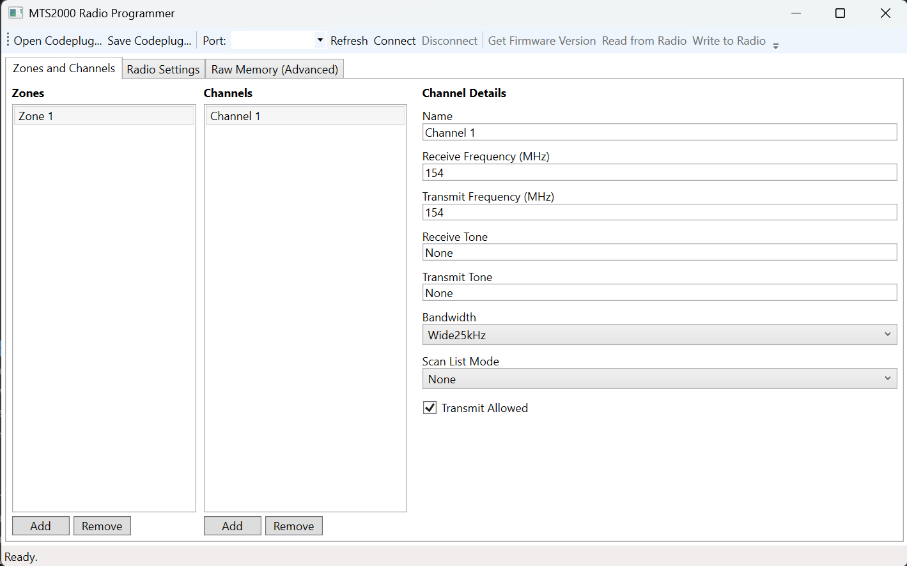

# MTS2000 Radio Programmer - Under development

[](https://github.com/fredfeldman/MTS2000/actions/workflows/ci.yml)

A WPF (.NET) codeplug editor and programming utility for the Motorola MTS2000
("Jedi" series) portable radio.

Repository: https://github.com/fredfeldman/MTS2000



## What it does

- Edit a codeplug (zones, channels, frequencies, tones, bandwidth, scan settings) in a
  friendly WPF UI.
- Save/load codeplugs as JSON files.
- Connect to a radio over a serial (RIB/USB-serial) cable, enter programming mode, and
  read back the firmware version to prove the link is alive.
- Low-level EEPROM memory read/write primitives for the real SB9600/SBEP transport.
- Raw EEPROM backup/restore: read an address range to a `.bin` file, or write a `.bin` file
  back to the radio (this does not decode channels/zones - see below).
- Read-only fixture capture: records a complete `0x8200`-byte EEPROM image, firmware version,
  radio metadata, firmware signature bytes, and the editor's expected decoded JSON for codec
  development.
- Remembers the last-used COM port between sessions and confirms before deleting a zone
  or channel.

## What it doesn't do (yet)

Decoding the radio's ~33KB EEPROM into the structured channel/zone model above requires
porting the MTS2000's full codeplug block map (block hierarchy, vector references,
per-block checksums, and the "Toolproof" auth-code algorithm). That has not been ported
into this project, so `ReadCodeplugAsync`/`WriteCodeplugAsync` currently throw
`NotSupportedException`. The transport layer they'd sit on (`RadioProgrammingSession`) is
real and working — see [Protocol reference](#protocol-reference) below.

### Capturing a codec fixture

After connecting and completing the firmware handshake, use **Raw Memory (Advanced) > Capture
read-only codeplug fixture...**. Enter the radio model, band, serial number, and matching
firmware signature bytes first. The selected manifest filename produces three files:

- `*.eeprom.bin`: exactly `0x8200` bytes read from EEPROM address `0x0000`.
- `*.expected-codeplug.json`: the current editor model, containing expected zone/channel values.
- `*.json`: metadata linking the image and expected model, including firmware version and the
  round-trip requirement.

This workflow never writes to the radio. The expected JSON should contain values independently
verified from the radio or an authoritative programming source before it is used as a codec test
oracle. Do not enable structured writes until decoding and re-encoding the binary produces the
same known-good image.

## Project layout

| Project | Purpose |
|---|---|
| `MTS2000.Core` | Models (`Codeplug`, `Zone`, `Channel`, `RadioSettings`), codeplug JSON save/load, and the radio communication layer (`Services/`, `Protocol/`). |
| `MTS2000.App` | WPF UI (MVVM via CommunityToolkit.Mvvm): zone/channel editor, radio settings tab, raw memory tab, connection toolbar. |
| `MTS2000.Tests` | xUnit tests for the protocol framing (`ControlBusFrame`, `ExtendedProtocolFrame`) and codeplug JSON round-tripping. |

### Protocol reference

The serial transport (`MTS2000.Core/Protocol`) implements the radio's control-bus
(mode switching, firmware version query) and extended memory-access protocol (EEPROM
read/write) framing. The protocol facts it's based on — frame layout, opcodes, and the
checksum table — were learned from the community reverse-engineering write-up in
[JediComlink](https://github.com/lf73/JediComlink); the code here is an independent,
clean-room implementation of those facts (JediComlink ships with no license, so its
source itself was not copied). It provides:

- `RadioProgrammingSession.EnterProgrammingMode()` / `QueryFirmwareVersion()` / `ResetRadio()`
- `RadioProgrammingSession.ReadEeprom(address, count)` / `WriteEeprom(address, data)`

## Requirements

- Windows
- .NET 10 SDK
- A RIB (Radio Interface Box) or RIB-less cable and USB-to-serial adapter to talk to real
  hardware (not required for editing/saving codeplug JSON files).

## License

GNU General Public License v3.0 — see [LICENSE](LICENSE).

## Build and run

```powershell
dotnet build MTS2000.slnx
dotnet run --project MTS2000.App
```

## Running the tests

```powershell
dotnet test MTS2000.slnx
```

## Disclaimer

This project is not affiliated with or endorsed by Motorola Solutions. Use only on radios
you own and only on frequencies you are authorized to operate on. The MTS2000 is a Part 90
commercial radio; transmitting on it requires an appropriate FCC license (or, for amateur
use, programming the radio for a band you are licensed in).
